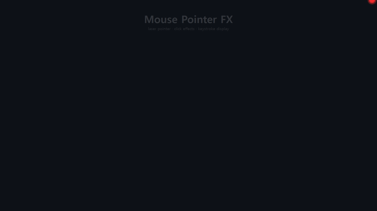

<div align="center">


# Mouse Pointer FX

**발표·녹화·강의를 위한 Windows 마우스 포인터 강화 오버레이**
_A Windows overlay for presentations: laser pointer, click effects & on‑screen keystrokes_


<br/>



</div>

---

투명한 전체화면 오버레이로 동작하며, 밑에 있는 프로그램은 **그대로 클릭**됩니다. 발표·화면 녹화·온라인 강의에서 마우스와 키 입력을 또렷하게 보여 주고 싶을 때 유용합니다.

## ✨ 주요 기능

| | 기능 | 설명 |
|---|---|---|
| 🔴 | **커스텀 포인터** | 크기·모양·색 변경. 기본은 **파워포인트형 빨간 레이저 점**(밝은 중심 + 글로우) |
| 💥 | **클릭 애니메이션** | 좌·우클릭 시 퍼지는 효과(확산 링 / 동심원 / 버스트 / 강조). 색·크기·지속시간 설정 |
| 🔦 | **레이저 포인터** | 단축키 토글, 빨간 점 + 페이드 잔상(트레일) |
| ⌨️ | **키 입력 표시 (keycast)** | 화면 중앙에 굵은 흰 글씨로 입력 키 표시 — 영문·**한글**·숫자·기호·특수키·`Ctrl`/`Alt`/`Win` 조합 |
| 🇰🇷 | **한글 자동 동기화** | OS 한/영(IME) 상태를 감지해 두벌식으로 자동 조합 — 따로 전환 불필요 |
| 🖥️ | **다중 모니터·고DPI** | 잠금/해제·해상도·모니터 변경 시 위치 자동 보정, 커서가 있는 모니터 기준 표시 |
| ⚙️ | **트레이 + 설정창** | 모든 값 실시간 변경·자동 저장, Windows 시작 시 자동 실행 |

## 🚀 빠른 시작

### 더블클릭 (가장 쉬움)
1. **`실행.bat`** 더블클릭 — 최초 1회 필요한 패키지를 자동 설치하고 콘솔 없이 실행합니다.
2. 트레이(우측 하단 `^`)에 빨간 점 아이콘이 생깁니다. 우클릭 → 설정/종료, 더블클릭 → 설정.

> Python이 없으면 [python.org](https://www.python.org)에서 설치하세요(설치 시 **“Add Python to PATH”** 체크).

### 명령어로 실행
```powershell
python -m pip install -r requirements.txt
python run.py
```

### 단축키
| 단축키 | 동작 |
|---|---|
| `Ctrl` + `Alt` + `L` | 레이저 포인터 켜기/끄기 |
| `Ctrl` + `Alt` + `K` | 키 입력 표시 켜기/끄기 |

## 📦 실행 파일(.exe)로 빌드

```powershell
build.bat
```
→ `dist\MousePointerFX.exe` 생성. Python 설치 없이 더블클릭으로 실행됩니다.

## ⚙️ 설정

트레이 아이콘 → **설정**. 모든 값은 실시간 반영되고 `%APPDATA%\MousePointerFX\config.json`에 저장됩니다.

| 탭 | 항목 |
|---|---|
| 포인터 | 사용 on/off, 시스템 커서와 함께 표시, 모양, 색, 크기, 불투명도, 글로우, 외곽선 |
| 클릭 | 사용 on/off, 스타일, 좌/우클릭 색, 크기, 지속시간, 두께 |
| 레이저 | 단축키, 색, 점 크기, 트레일 on/off·길이, 글로우, 시작 시 자동 켜기 |
| 키 입력 | 단축키, 글자 색·크기, 표시 시간, 최대 글자 수, 위치(중앙/하단), 굵게, 한글 조합 모드 |
| 일반 | 시스템 커서 숨김, Windows 시작 시 자동 실행, 갱신 주기(Hz) |

## 🧩 동작 원리

- 가상 데스크톱 전체를 덮는 **투명·클릭 통과(click‑through)** 오버레이에 직접 그립니다 → 밑의 프로그램 클릭은 정상 동작.
- 커스텀 포인터 사용 시 실제 **시스템 커서를 숨기고** 우리 포인터를 그리며, **종료 시 자동 복원**됩니다.
- **Per‑Monitor‑V2 DPI** 인지 + Qt 스케일 1 고정으로 다중 모니터/고DPI에서 좌표가 어긋나지 않습니다. 화면 잠금/해제 시 가상화면 변화를 감지해 **자동 재동기화**합니다.
- 키 입력 표시는 keycast가 켜졌을 때만 키를 캡처합니다(평소엔 캡처하지 않음).
- 한글은 글자 입력마다 OS의 한/영 상태(`WM_IME_CONTROL`)를 읽어 **두벌식 자동 조합**으로 표시합니다.

> ℹ️ 일부 최신 앱(Chrome, 일부 UWP 등)은 TSF를 써서 한/영 상태 조회가 안 될 수 있습니다. 그때는 직전 모드를 유지하며 설정의 “한글 조합 모드”로 맞출 수 있습니다. UAC 보호(관리자 권한) 앱 위에서는 전역 후킹/오버레이가 제한될 수 있습니다.

## 🛠️ 기술 스택

`Python 3` · `PyQt6`(오버레이·설정 UI) · `pynput`(전역 입력 후킹) · `pywin32`/`ctypes`(Win32·커서·DPI·IME) · `PyInstaller`(패키징)

## 🧪 테스트

```powershell
python -m pytest tests/ -q
```
설정 병합/저장, 클릭·레이저 효과 수명, 키 입력 분류·단축키 매칭, 한글 두벌식 조합, 오버레이 재동기화 등 **88개** 단위 테스트.

## 📂 프로젝트 구조

```
run.py                      진입점(시작 오류 시 메시지박스+로그)
src/mousepointerfx/
  app.py                    조립 + 트레이 + 생명주기/커서 복원
  overlay.py                투명 오버레이 창(프레임 루프·그리기·재동기화)
  cursor_renderer.py        포인터/클릭/레이저/keycast 그리기(QPainter)
  effects.py                리플/트레일 수명·기하 계산(순수 로직)
  keycast.py                두벌식 한글 오토마타 + 키 표시 버퍼(순수 로직)
  config.py                 설정 로드/저장/기본값(순수 로직)
  input_hook.py             전역 클릭/단축키/키 캡처(pynput, vk 기준 매칭)
  win_cursor.py             시스템 커서 숨김/복원(ctypes)
  win_ime.py                포그라운드 한/영(IME) 상태 조회(ctypes)
  settings_window.py        설정 UI
tests/                      단위 테스트
실행.bat / build.bat        실행 / .exe 빌드
```

## 📄 라이선스

[MIT](LICENSE) © 2026 lsy3709
